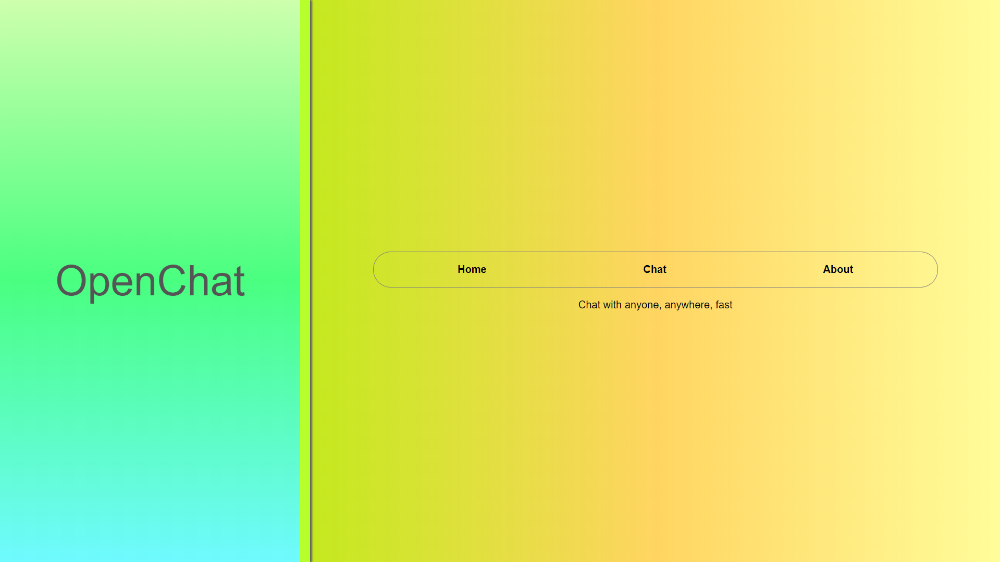
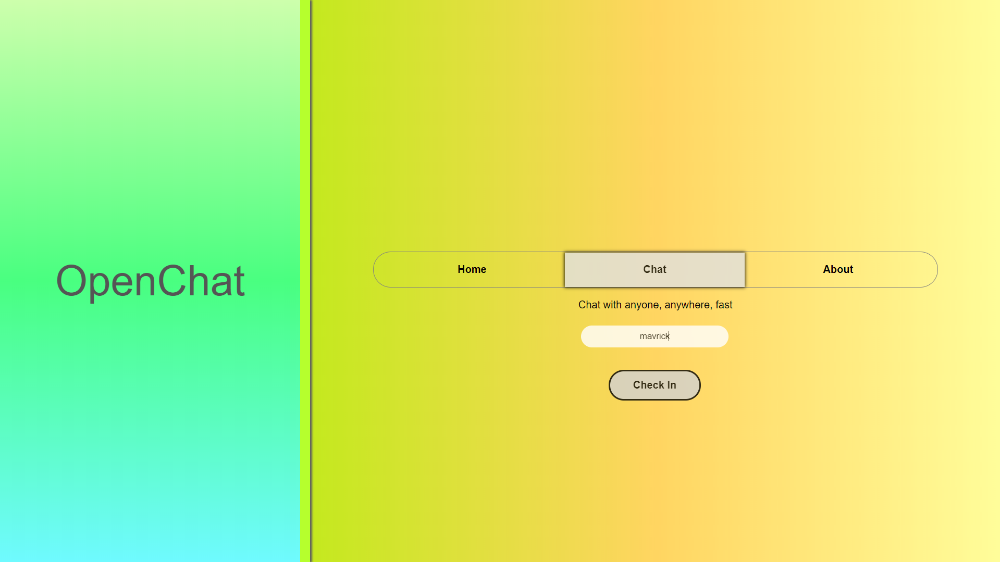
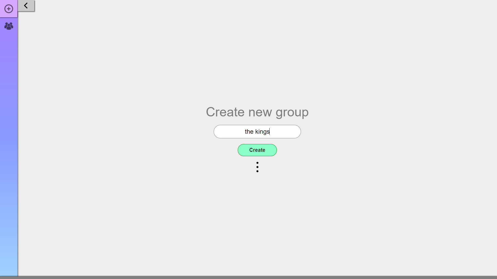
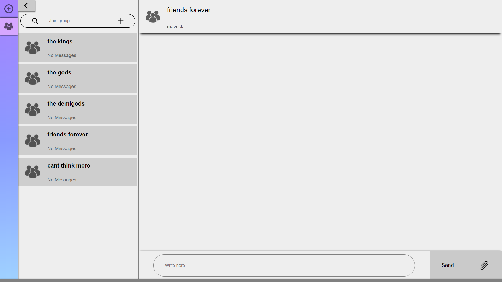
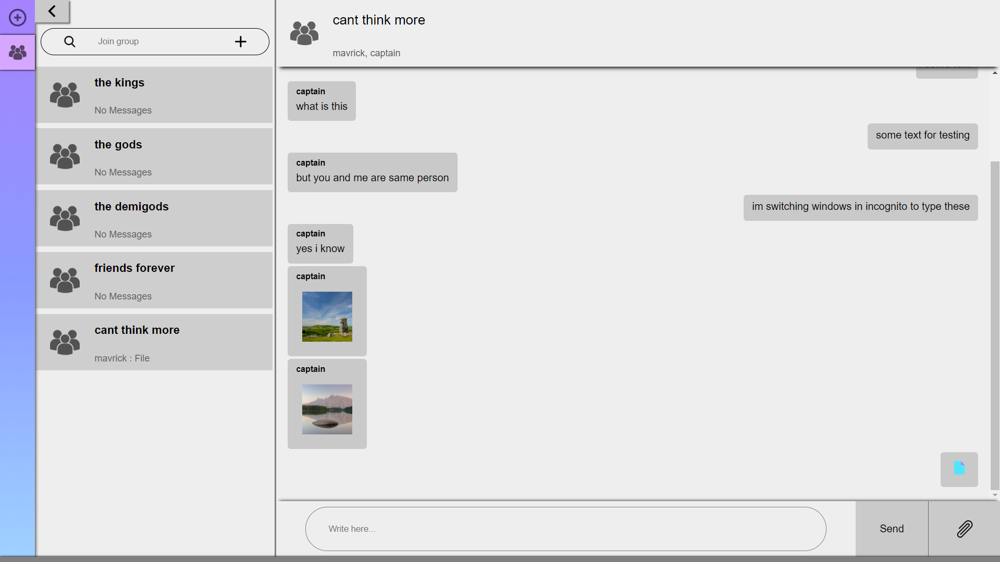

# OpenChat

A totally transparent messaging webapp, no login, no authentication, useful for fast communication

Just type your name and start communicating fast in groups

* Multi group, multi member 
* File sharing (not limited to file type, go ahead and share your .exe's, .apk's, .anything)
* Persistent file storage in browser

Check it out [here](https://share-fast.herokuapp.com/)

Note: Don't send confidential info, because, its... OpenChat !
